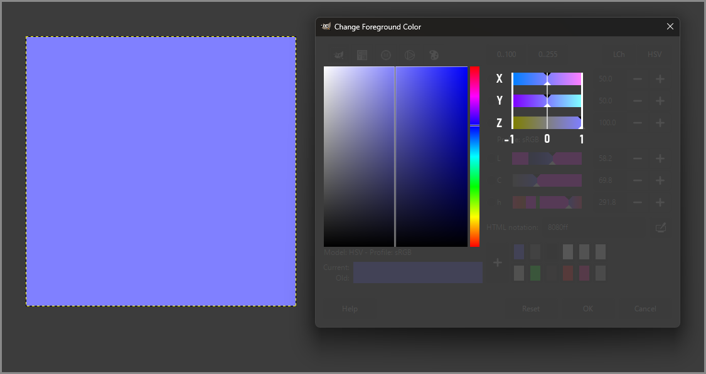

# Blender Game Tools

This addon packs several **professional-grade techniques** commonly used in the **video game industry**: *Vertex Animation Textures, Bone Animation Textures, Object Animation Textures, Pivot Painter 2.0, UV Pivots* and more.

# Summary

- [Installation](#installation)
- [Documentation](#documentation)
  - [VAT - Vertex Animation Textures Baker](#vat---vertex-animation-textures-baker)
    - [VAT - Theory](#vat---theory)
    - [VAT - Packing, Interpolation, Padding & Resolution](#vat---packing-interpolation-padding--resolution)
    - [VAT - Documentation - Mesh Sequence](#vat---documentation---mesh-sequence)
    - [VAT - Documentation - Animation](#vat---documentation---animation)
  - [OAT - Object Animation Textures Baker](#oat---object-animation-textures-baker)
    - [OAT - Theory](#oat---theory)
  - [BAT - Bone Animation Textures Baker](#bat---bone-animation-textures-baker)
    - [BAT - Theory](#bat---theory)
  - [Pivot Painter](#pivot-painter)
    - [Painter Painter - Theory](#pivot-painter---theory)
  - [Data - Data Baker](#data---data-baker)
    - [Data - Theory](#data---theory)
- [Tech Art Compendium](#tech-art-compendium)
  - [Compendium - Unique vertex attributes](#compendium---unique-vertex-attributes)
  - [Compendium - UV map cost and count](#compendium---uv-map-cost-and-count)
  - [Compendium - UV Precision](#compendium---uv-precision)
  - [Compendium - Lightmap UV](#compendium---lightmap-uv)
  - [Compendium - Collisions](#compendium---collisions)
  - [Compendium - Bounds](#compendium---bounds)
  - [Compendium - Distance Fields](#compendium---distance-fields)
  - [Compendium - Virtualized Rendering Systems (Nanite & VSM)](#compendium---virtualized-rendering-systems-nanite--vsm)
  - [Compendium - Raytracing](#compendium---raytracing)
  - [Compendium - Texture compression settings, interpolation & nearest sampling](#compendium---texture-compression-settings-interpolation--nearest-sampling)
  - [Compendium - Fixing Normals](#compendium---fixing-normals)
  - [Compendium - NPOT Textures](#compendium---npot-textures)
  - [Compendium - Remapping](#compendium---remapping)
  - [Compendium - Packing](#compendium---packing)
  - [Compendium - Packing - Integer/Fraction](#compendium---packing---integerfraction)
  - [Compendium - Packing- Three floats into one](#compendium---packing---three-floats-into-one)
  - [Compendium - Packing- Two floats into one](#compendium---packing---two-floats-into-one)
  - [Compendium - Packing- Pivot Painter](#compendium---packing---pivot-painter)

# Glossary

- **VAT** - The process of baking vertex data into textures AND the resulting texture(s)
- **BAT** - The process of baking bone data into textures AND the resulting texture(s)
- **OAT** - The process of baking object data into textures AND the resulting texture(s)
- **POT** - Power of Two
- **NPOT** - Non Power of Two
- **DCC** - Digital content creation. A term commonly used to refer to generic 3D applications, such as 3dsMax, Blender, Maya etc.
- **PBR** - Physically based rendering
- **DXT** - A group of lossy texture compression algorithms (sometimes also called DXTn, DXTC, or BCn)
- **Texel** - Texture element, or texture pixel. The fundamental unit of a texture map
    
# Installation
This addon is available as an **official** [Blender extension](https://extensions.blender.org/about/). 

If this isn't an option, you could still first download a **ZIP** of this git repo.


Then, open the **Edit>Preferences** window, go to the **Get Extensions** tab and search for **Install from Disk** in the dropdown menu located at the very top-right.


# Documentation

## VAT - Vertex Animation Textures Baker

**Vertex Animation Texture** (VAT) is one of the simplest technique for **baking skeletal animation(s)** (or any animation) **into textures** by encoding data per vertex, per frame, in pixels. These textures are then sampled in a **vertex shader** to **play the animation** on a **static mesh**.

This can lead to significant performance gains, as rendering skeletal meshes is typically the most expensive way to render animated meshes. By using static meshes, you can leverage instancing and particles to efficiently render crowds, etc. However, this technique also has its own pros and cons, which we'll discuss in the following sections.

### VAT - Theory

For **each frame and vertex**, an **XYZ offset** is stored in the **RGB channels** of a **unique pixel** in a texture. That vertex offset indicates how much the vertex has moved from the rest pose, at that frame.


> [!NOTE]
> You can opt for storing the vertex's *local position* instead of an *offset from a reference pose*. That local position would likely have to be then transformed from local to world space based on the mesh's world matrix. Working with offsets is typically simpler, especially in *Unreal Engine*.

Offsetting vertices in a vertex shader **does not update the normals** for reasons explained in detail in the [compendium](#compendium).

Thus, **for each frame and vertex**, it's also common to bake the **XYZ vertex normal into a second VAT**. This can be skipped if the animations are minimal, with little movement, and/or if you don't mind the lighting/shadow issues you get from *not* updating the normals (e.g. for distant props).

> [!IMPORTANT]
> Vertex normals are interpolated in the pixel shader and when sampling a normal VAT, it is of utmost importance to prevent this from happening, for reasons that are discussed further below. This essentially boils down to sampling the normal VAT in the vertex shader and using a vertex interpolator.

Finally, to **sample** the offset and normal VATs, a **special UVMap** is created to **center each vertex on a unique texel**.


Playing the animation in the vertex shader thus simply involves *manipulating the UV coordinates* of that UVMap to sample the texels corresponding to the desired frame. Often, it simply boils down to offsetting the V component, assuming a **one-frame-per-row** packing scheme was used, more on that in the following section.


### VAT - Packing, Interpolation, Padding & Resolution

The simplest way data can be stored in a VAT is using a **one-frame-per-row** packing scheme. Let's consider baking a skeletal mesh made of **400 vertices** and having **200 frames** of animation. The resulting **VAT resolution** would be **400x200**: 200 rows (frames) of 400 pixels (vertices). In other words, the VAT texture would contain the data of every vertex for every frame, one frame stacked on top of each other.


> [!NOTE]
> This method severly constraints the amount of vertices that can be baked, something that is discussed in later sections

**Playing the animation** involves sampling the texture and **offsetting the V coordinate by one row/texel at a time**.


Since each frame is *adjacent* in the texture, the pixel interpolation that naturally occurs when sampling a texture on the GPU can be used to **get frame linear interpolation for free**. *UVs between two frames will average them*, allowing the V axis to be simply *scrolled* to get a butter smooth animation.


> [!IMPORTANT]
> UVs may be stored in 16 bits by default in some game engines, including *Unreal Engine*, as discussed in the [compendium](#compendium). Thus, precision issues might arise with larger textures and undesired interpolation might occur between frames but also between vertices as well. That is something that can be prevented using **Nearest sampling** which, however, no longer allows us to leverage pixel interpolation to get frame interpolation for free. This is further discussed in later sections

Frame interpolation can be troublesome when **baking multiple animations** and **looping a specific one**. VATs are often used to **render and animate crowds**, where some kind of state machine *selects* and *cycles through animations*. Playing a specific clip in a VAT containing multiple clips merely involves *clamping the V coordinate* to a specific *clip's range* and *wrapping* it around when needed.


In such a case, pixel interpolation (and thus frame interpolation) can be an issue because, when looping a specific clip, we would need to interpolate between that clip's last and first frames. However, since the VAT describes the whole animation as a simple stack of frames, the last frame will instead interpolate with the first frame of the next animation, and the first frame with the last frame of the previous animation.


This can be fixed by adding extra frames to the VAT, a process we may call **padding**. For each clip, *insert its last frame before its first*, and *append its first frame after its last*.


While **padding** duplicates frames and thus slightly **increases the VAT resolution**, the benefits should outweigh the drawbacks. That is, assuming you do use GPU interpolation to get frame interpolation for free, *else padding serves no purpose*.

> [!NOTE]
> You may choose to add padding on last frames only or first frames only but that’s assuming you know the direction the V coordinates have to be scrolled in, which may vary depending on the UV coordinate system of the targeted game engine/graphics API, and that animations may only be played in that direction.

Now, this **one-frame-per-row** packing scheme has its limits and there are a couple of things to note.

Firstly, it often results in **non-power-of-two (NPOT) VATs**. Vertex & frame count are simply unlikely to be a power of two. NPOT textures are thoroughly discussed in the [compendium](#compendium), and while they shouldn't cause much concern in 2025 in the context of VATs, it may still be wise to assume they *may not* behave like any regular POT texture.

> [!NOTE]
> If NPOT textures are an issue, VATs can simply be padded with blank pixels to fit the next POT resolution, and the corresponding vertex-to-texel UV map can be updated (note that extra padding decreases the texel size). Again, this is probably not something you need to worry about in 2025, but it had to be mentioned for the sake of completeness in this documentation.

Secondly, when working with VATs, **exceeding 4096 pixels** is generally **not recommended**. 8K textures may not be supported on mobile or web apps and you **can't downsize a VAT** like you would with, say, a troublesome diffuse or roughness texture. Each texel in a VAT texture *holds specific information* that *can’t be lost* or averaged with nearby texels! If you need such a high resolution anyway, one might ask if VATs is the correct method for what you have in mind. There are other baking techniques that may be better suited, like *Bone Animation Textures*, and newer file formats like *Alembic* that may be worth considering.

Finally, assuming you don’t want to exceed 4096 pixels, it obviously limits you to baking *no more than 4096 frames* (which is fine for most cases) and *no more than 4096 vertices* (which is more restrictive). An **alternative packing method exists** that alleviates this constraint, though it comes with its *own drawbacks*.

The workaround is to use **multiple rows** to store **one frame**'s worth of vertex data.


**Sampling** the animation then involves offsetting the V coordinates by the **appropriate row/texel amount**. Note that pixel interpolation can no longer be used for frame interpolation, as it would cause interpolation with other vertex data, not the next frame.


Additionally, padding is unnecessary since interpolation is no longer an option. At this point it is recommended to use [**Nearest sampling**](#compendium) to prevent the GPU from interpolating pixels and picking the closest texel instead. This may be particularly relevant if you happen to bake a lot of vertices and/or frames. As the VAT resolution increases to contain more data, the distance between each texel diminishes.


Precision, when it comes to storing numbers in computers, is an issue as old as computer science. In fact, each vertex UV isn’t precisely centered on a texel. There’s a tiny bit of jitter and the amount of imprecision might become concerning as the distance between texels get too small, or in other words, as the VAT size increases. This is especially true as UVs might be stored in 16 bits float by default in most game engines, including *Unreal Engine*. This is further discussed in the [compendium](#compendium). Sampling a VAT with pixel interpolation might thus induce a tiny bit of ‘data corruption’ as each vertex might not precisely sample the desired frame, nor the desired vertex data as well. Thus, using **Nearest sampling** is often recommended.


Using **Nearest sampling** might not even totally fix imprecision issues because of 16 bits float UVs. As you approach 4K and higher resolutions, the distance between each texel is so small that the amount of imprecision in the UVs might be great enough for the GPU to pick the wrong texel. In such case, you might try to use 32 bits UVs on that mesh if possible. This is called *full precision UVs in Unreal Engine*. This obviously makes the mesh use [more memory](#compendium) and should only be enabled if you encounter an issue that you're sure is caused by 16 bits UVs.


> [!NOTE]
> Note that it is still possible to get **frame linear interpolation** despite using **Nearest sampling**. It simply involves sampling the VAT texture a second time, one frame ahead and doing the interpolation in the vertex shader manually, something that shouldn't be too expensive for most applications. This could even be toggled off at a distance on LODs etc.

To conclude on packing methods, there’s a third method of packing frame data in VATs, one that may be called **continuous** and one that best utilizes the empty pixels that you may either get with the **one-frame-per-row** packing scheme if requiring POT VATs, or with the **multiple-rows-per-frame** packing scheme.


This packing method simply stores one frame after the other and leaves no empty pixel.


This requires a more complex algorithm to generate the UVs for sampling the VATs, and is considered experimental as it still needs thorough testing to ensure it doesn’t encounter precision issues with a high frame count. On paper, this **continuous** packing method promises to maximize the VAT's resolution and allows data to be tightly packed in POT textures, ensuring wide hardware support.

### VAT - Documentation - Mesh Sequence


### VAT - Documentation - Animation


## OAT - Object Animation Textures Baker

**Object animation texture** (OAT) is a process almost identical to **vertex animation texture** (VAT). However, it makes *one assumption* that opens the door to a whole new way of thinking: **vertices that are part of the same object all move similarly**.

### OAT - Theory

Instead of baking the offset and normal data for each vertex at every frame, which would result in a *lot of duplicated data if this assumption holds true*, **the position of the object itself is baked instead**. All vertices that are part of the same mesh point to the same texel, and similar UV scrolling techniques as VATs can be used to play the object animation. This, of course, supports multiple objects, just as VATs support multiple vertices.

Furthermore, the **object’s orientation** is baked along with its position. Therefore, the vertices can be translated to follow the object’s initial trajectory, while also being rotated around the object’s position to play the object’s rotation. This involves baking a *quaternion*, which can be packed into a single float using the '*[smallest three](#compendium)*' packing method. As a result, a single, very low-resolution 32-bit RGBA *HDR* texture can be used to store the object’s position in the RGB channels and its orientation in the alpha channel, making it an extremely efficient method for playing vertex animation at the object level. Scaling can also be baked and applied in the vertex shader.

## BAT - Bone Animation Textures Baker

**Bone animation texture** (BAT) is a more recent and, quite frankly, somewhat obscure technique compared to **vertex animation texture** (VAT). *VAT* is highly versatile because it simply stores vertex offset and normal data, making it *agnostic to the underlying animation technique*. The baked animation can come from a mesh animated and deformed using a skeleton/armature, shape keys/morph targets, modifiers, keyframes, etc. As long as the topology and vertex order remain unchanged during the animation, *VAT* allow for a 1:1, non-destructive baking process.

**Bone animation texture**, on the other hand, is **specific to baking skeletal animations** and is often *destructive*. While *BAT* may seem less appealing than *VAT*, it has significant advantages, such as much lower texture resolutions and consequently, a smaller memory footprint. In fact, the texture resolution is no longer determined by *vertex count*, but by **bone count**, making it much more efficient for animating static meshes with lots of vertices.

### BAT - Theory

A special UV map is again used to **assign each vertex a unique texel in an RGBA texture**. This **texture encodes the bone index and bone weight** to which the vertex is parented. Up to *four bones* can be encoded per vertex, one per channel in the texture. This replicates the vertex skinning data from the DCC software.

By sampling this texture, the **bone index** can be extracted to sample the bone animation texture at the correct row of texels for that specific vertex, retrieving the bone pivot and orientation at the desired frame.

For optimal performance, you may choose to sample only one bone in the vertex shader. However, this will likely result in a *lossy bake*. In this case, vertices would only be ‘*parented*’ to a *single bone* and *fully inherit its transform*, which is typically not the desired result. Organic skinning often requires a vertex to inherit the transforms of multiple bones to varying degrees.

This is why the **bone weight** is also extracted to determine how much the vertex will inherit the bone’s translation and rotation, replicating the initial vertex skinning. The process can then be repeated to sample the index and weight of the *second, third, and potentially fourth bone* the vertex is '*parented*' to. The sum of the bone weights should equal 1.0 to ensure the vertex fully moves.

Since we’re working with pivot and rotation, the *vertex normal can also be rotated*, eliminating the need to store normal data per vertex. Applying bone scale is technically possible but is not typically implemented, as scaling bones in game engines is generally *avoided* for various technical reasons. Therefore, supporting bone scale is quite rare, if ever needed at all.

## Pivot Painter

### Pivot Painter - Theory

## Data - Data Baker

The Data Baker tool aims to **facilitate and automate** the process of **baking arbitrary data into vertex color and UVs**.

### Data - Theory

The concept of **baking data into UVs and Vertex Colors** is likely as old as real-time rendering itself.

Many artists and tech artists are probably already familiar with using **vertex colors to paint masks** in the **RGBA channels**. These masks are commonly used to drive artistic processes, such as customizing a material: fading in moss here, adding cracks to a brick texture there, sprinkling sand between floor cracks, and so on. You get the idea, using vertex colors is usually a very *painterly process* to control artistic parameters.

Taking a step back, one might wonder if the **RGB channels of vertex colors** could simply be used to **store the XYZ components of a vector**, any vector. And with some care, they can. The vertex color RGBA channels can be thought of as a way **for each vertex to store four 8-bit integers**.

Similarly, artists are often taught to view **UVs** solely as a means of **storing coordinates for texture projection** onto a 3D surface, along with the constraints that come with this mindset: *limiting texture deformation*, *hiding seams*, *staying within the [0:1] bounds* etc. However, if we take a step back, just like vertex colors, UVs can be seen as a way for **each vertex to store two 16- or 32-bit floats**. Most DCC softwares and real-time applications allow up to eight UV maps, which means up to **16 floats can be encoded per vertex**. 

While you do usually need to follow *general guidelines* when *authoring a UV map for texture projection*, like limiting stretch, these constraints *no longer exist* and possibilities become endless when you start thinking of **UVs as a way to store arbitrary data**, such as *baking pivots*, *axis*, *normals*, *shape keys/morph targets*, and so on.

Let’s start with a basic idea and iterate on it. This asset is composed of many individual grass blades, each with its **own pivot point**, allowing them to rotate around it to simulate wind motion amongst other things.

However, once exported into a game engine, these individual meshes are **merged**, and their **pivot points are lost**. As a result, applying a simple oscillating rotation in the vertex shader causes the entire mesh to rotate together. Therefore, the idea is to **store these pivot points** so they survive the export process and can be retrieved in the vertex shader. The goal is for each vertex to rotate around its specific pivot point.

To achieve this, we can **create a UV map** where **each vertex stores a UV coordinate corresponding to the XY position of the pivot point** it needs to rotate around.

> [!NOTE]
> For this asset, the **Z component is irrelevant** since all pivot points are placed on the ground, so Z is simply 0. However, if the Z component of the pivot point needed to be stored, an additional UV map could be used to store it in the U coordinate, leaving the V component free to store any other necessary data.

> [!IMPORTANT]
> The position's X and Y components might **exceed the [0:1] range**, and could even **be negative**, but that's perfectly fine. Staying within the unit range is only somewhat relevant when using UVs to sample a texture. The GPU might wrap or clamp the coordinates, which alter how the texture is sampled. However, UVs are typically 16-bit floats in most game engines, and can even be 32-bit floats if needed so they are perfectly suited to store any arbitrary number, *floating point precision issues aside*.

> [!IMPORTANT]
> When storing data in UVs, it is crucial to understand that the **UV coordinate system** in the application where the data is baked (DCC software) **may differ** from the UV coordinate system in the target application (game engine). For example, *Blender* is OpenGL-oriented, so UV(0,0) is located at the bottom-left corner. On the other hand, *Unreal Engine* is DirectX-oriented, meaning UV(0,0) is at the top-left corner. To convert between the two, a **one-minus (1-x)** operation is necessary. This operation needs to be performed only once and should ideally be done during the bake process. However, nothing prevents you from performing this operation in the vertex shader when sampling the texture instead. Additionally, it's important to recognize that the **world coordinate system may vary** between applications. While *Blender* and *Unreal Engine* have similar X and Z world axes, their *Y axes are inverted*. As a result, any Y component, whether it's a position or a vector, must have its **sign flipped**. Moreover, **scale** is important. *Blender*'s default unit is **one meter**, while *Unreal Engine*'s default unit is **one centimeter**. Therefore, a scale factor of 100 may need to be applied, either during the bake or when reading UVs as positions or offsets.

Once the mesh is exported into a game engine, that extra UV map can be accessed to read the value it stores. In this case, the XY components of the pivot position, processed to match both UE's UV and world coordinate systems: one-minus on the V axis, Y axis sign flipped and meters converted to centimers.

An additional UV map could be used to store the pivot's Z component and the XYZ pivot position could then be reconstructed in the vertex shader like so.

# Tech Art Compendium

This compendium focuses on topics relevant to this *Blender* addon, primarily addressing **side effects and important considerations when using vertex offsets and storing data in UVs and Vertex Colors**. It may be worth reading, whether you use this addon or not.

## Compendium - Unique vertex attributes

A vertex can only have **one attribute of a given type**:
  - One position
  - One normal
  - One RGBA vertex color
  - One UV coordinate per UV map

What does this mean for UV seams? A vertex might have *two UV coordinates in a single UV map*.


In simple terms, the **mesh will be cut**, and these **vertices will be duplicated** so that one set of vertices has one UV coordinate, and the other set has the other UV coordinate.


This can easily be proven. When exporting two cylinders to *Unreal Engine*, one with *no UV map* and the other with a UV map containing a *single seam*, the latter contains two extra vertices for the seam.


This **principle applies to all vertex attributes**, such as *normals*. To create a hard edge or, more broadly, to create flat faces, vertices must be duplicated so that some have their normals pointing in one direction, and others have their normals pointing in another direction.


Again, this can be easily demonstrated. When exporting two spheres to *Unreal Engine*, one with *smooth shading* and the other with *flat shading*, the latter contains a significantly higher number of vertices, simply because each face duplicates all its vertices so they can have unique normals.


The same principle applies to vertex colors. For a face to have a vertex color different from an adjacent face, the mesh must be cut, and the connected vertices must be duplicated so that some store one color, while the rest store another color.


This results in an increased vertex count that can be predicted and confirmed in any game engine.

> [!NOTE]
> This concept may cause confusion for new artists and tech artists, mainly because a DCC software tries its best to hide this process for a better user experience. However, this still happens under the hood in all DCC softwares, and it is certainly true for all game engines as well. When in doubt, if you’re using UVs or Vertex Colors to store arbitrary data or manipulating normals in an unusual way, just ask yourself if the data is per face or per vertex. Most of the time, it will be per vertex, with UV seams and hard edges being the most notable exception.

> [!IMPORTANT]
> This isn’t a concern for VAT, BAT, OAT, and Pivot Painter. The extra UV map they all create assigns a single UV coordinate per vertex, so no splits are induced and no vertices are duplicated. However, this may be a concern when baking arbitrary data in UVs, such as a random value per face, but this is a very rare use case. Most reasons for baking data in UVs, including storing pivots, axes, etc., all assign a single UV per vertex, so no splits are induced. The concept of a vertex being limited to storing a single attribute of a given type is fundamental to tech art and is included in this documentation for the sake of completeness.

## Compendium - UV map cost and count

There are many misconceptions about the **cost of UV maps**, with some claiming that each additional UV map induces an extra draw call. This is simply **not true**.

While *UV maps do have a cost*, it’s not as drastic as often suggested. The main impact is on the **mesh's memory footprint**: *two 16-bit floats per vertex per UV map*, in *Unreal Engine* at least, unless '*full precision UVs*' is enabled, in which case the cost increases to *two 32-bit floats per vertex per UV map*.

The increased memory footprint can be easily predicted. For example, for a mesh with 400 vertices, adding one UV map results in an additional 1.6 kilobytes of memory. This can be measured and confirmed in *Unreal Engin*e using the Size Map feature.

While an increased memory footprint does have some impact on memory bandwidth sooner or later, that's about it. Adding an extra UV map to a static mesh is unlikely to cause a measurable performance impact. However, using 8 UV maps on all your assets could tell a different story. If you need that many UV maps to store arbitrary data, one might question whether UV maps are the best medium for storing this data.

> [!WARNING]
> In most game engines, including *Unreal Engine*, there’s a hard limit on the number of UV maps: 8 for static meshes and 4 for skeletal meshes.

## Compendium - UV Precision

In most game engines, for performance purposes and to save memory, **UVs are stored as 16-bit floats**.

16-bit floats provide *sufficient precision for everyday tasks*, such as sampling 4K textures, and allow for positive and negative values across a wide range. However, when storing arbitrary data in UVs, 16 bits may not provide enough precision (this is discussed in greater details [further down below](#compendium). In such cases, 32-bit UVs can be enabled in most game engines. In *Unreal Engine*, this is exposed through the '*full precision UVs*' option in the static mesh editor.

## Compendium - Lightmap UV

Good old lightmaps require unique UV layouts, and in game engines where using lightmaps is common practice, or at least was, like *Unreal Engine*, it’s typical to see lightmap UVs automatically generated upon mesh import. This assumption can interfere with your setup and override any additional UV map you've used to store pivots, etc. Always double-check that such options don’t get in your way.

## Compendium - Collisions

Applying any kind of vertex movement or offset in a **vertex shader occurs on the GPU**, near the end of the rendering pipeline, and the **CPU is completely unaware of this step**.

As a result, *collisions*, which are typically *solved on the CPU* except in a few specific custom game engines, are stil based on the original collision primitives you may have set up in your game engine, or the mesh's triangles, *as if no vertex shader had been used*.

> [!NOTE]
> There's no way around it. Some game engines might expose settings to bake a fixed vertex offset into some kind of collision data, like *Unreal Engine*'s landscape that may account for the landscape's material WPO, but it's extremely limited and it is best assumed that collisions and vertex animation don't go hand in hand, period.

## Compendium - Bounds

Bounds are used by the CPU to determine if a mesh is in view and thus, if it should be rendered. Similarly to collisions, **bounds are precomputed** based on the static mesh's raw vertex data.

As a result, a mesh that **may appear to be in view** based on its precomputed bounds **might no longer be in view once its vertices are displaced on the GPU** by a vertex shader. Conversely, a mesh that **isn’t in view** and is therefore **occluded** might actually be **in view after its vertices are displaced on the GPU** by a vertex shader, but by that point, it’s **already been culled**. So, you can effectively make objects disappear!

You get the idea, this widely used, bounds-based, occlusion process doesn’t work well with vertex animation and vertex offsets. Unfortunately, there’s no magic solution to this issue, except to **arbitrarily increase the mesh’s bounds by a certain amount to account for vertex animation or the maximum expected offset**.

> [!NOTE]
> Increasing bounds will reduce the chances of the mesh being culled, essentially leading to a performance impact, as the mesh will likely be rendered more often due to its increased *apparent overall size*. The impact is hard to quantify and depends on the specific mesh and scene.

## Compendium - Distance Fields

Still on the topic of precomputed data: distance fields. They have become quite popular and are now widely used in almost all game engines.

A distance field is essentially a **3D volume encapsulating a mesh**, where **each voxel encodes the distance to the nearest surface of the mesh**, negative if inside it. With this data, and using a few derivative tricks, the *direction to the nearest surface can be deduced*. Together with the distance, this allows the *nearest position on the mesh to be found from any location within the 3D volume*.

However, computing the distance to the nearest surface of the mesh for each voxel can be quite a taxing process for the CPU and/or GPU, which is why **distance fields are almost always precomputed** based on the mesh’s raw vertex data. As a result, no vertex animation or offset is taken into account, which can **mess up lighting, shadows**, and any other rendering feature that relies on distance fields in one way or another. A mesh may be animated on the GPU using a vertex shader, but its distance field will remain fixed.

> [!NOTE]
> Similar to bounds, there’s no magic solution to this, and the one "hack" typically exposed in game engines like *Unreal Engine* is the ability to offset the distance field self-shadowing distance. Unfortunately, this doesn’t offer much flexibility. Moving vertices on the GPU isn’t really compatible with techniques that rely on precomputed data, that’s just how things are.

## Compendium - Virtualized Rendering Systems (Nanite & VSM)

**Nanite** and similar **virtualized geometry** techniques **don’t work well with vertex animations and offsets** for reasons that are well beyond the scope of this documentation.

The same goes for **virtual shadow maps**, which are, at their core, a **caching technique**. And just like with any caching technique, the cache isn't meant to be trashed every frame just because a few vertices have moved. It can be, but the cost is usually very high.

> [!NOTE]
> I’m not up to date with the solutions currently offered in *Unreal Engine* to alleviate these issues, and I’d imagine it's a similar situation in other engines implementing similar technologies. Unfortunately, offsetting vertices on the GPU doesn’t work well with these new technologies; that's just the reality of the situation. It doesn’t mean it’s impossible, but you’ll need to dig deep and find the tricks that work best for your specific use case (e.g. it’s possible to tell Nanite a maximum offset per material, tweak the VSM invalidation cache behavior per asset etc.)

## Compendium - Raytracing

This is not my area of expertise, but vertex shaders are typically supported in ray-tracing implementations. Some options might need to be enabled, as this feature may not be enabled by default due to the increased cost. In Unreal Engine, this used to be exposed through the ‘Evaluate World Position Offset’ option at one point. However, I’m not up-to-date and can't guarantee that this is still the case.

## Compendium - Texture compression settings, interpolation & nearest sampling

When using textures to store arbitrary data, it’s important to understand not only how the **data can be stored and compressed** but also how it is **sampled**.

Texture formats are discussed in greater details the [remapping](#remapping) section. To summarize, textures are most often RGBA 8-bit integers, commonly referred to as *RGBA8*. This format works well for everyday use and is more than sufficient for most *PBR* maps (such as diffuse, roughness, etc.), even allowing for different *DXT* compression modes depending on the use case.

That said, *RGBA8* is likely impractical for storing arbitrary data in many technical applications, such as *VATs* or *Pivot Painter*, among others. The range is simply too limiting. *HDR* textures, either 16- or 32-bit, are typically required for these applications. Additionally, **texture compression is usually not an option**. Compression typically *scrambles bits* and *performs optimizations in blocks of pixels*, something that can't be allowed in our case. *VATs* and similar techniques store critical information per pixel that *can't be averaged* with nearby pixels without causing undesired issues. Moreover, Pivot Painter uses [**bit-packing**](#bit-packing) methods, and **any form of compression would scramble bits, corrupting the packed data**.

For all these reasons, you'll likely want to limit yourself to uncompressed *RGBA8*, *HDR16*, or *HDR32* texture compression settings when using techniques like VATs.

Having a solid understanding of the technical implications of working with a specific data storage format is just the beginning. **Sampling** can be just as complex.

Most often, textures are sampled using coordinates stored in UV maps. As mentioned [here](#UVs), these UVs are typically stored as *16-bit floats*, which limits precision. This is usually not a problem, as small amounts of jitter or imprecision in UVs typically don't cause visible issues when sampling regular textures, such as diffuse or roughness maps. 

However, for *VATs*, *Pivot Painter*, and similar techniques where *each vertex needs to precisely read the data stored in a particular pixel*, UV jitter resulting from the use of 16-bit floats can become an issue.

By default, GPUs perform **bilinear interpolation** between the four texels closest to the given UV coordinates.

Therefore, if you want to read the value stored in a specific pixel rather than sampling it, this could become an issue.

Let’s assume the VAT is 2x2, an unrealistically low resolution, but let’s go with it. Each texel is separated by *half a unit*, with one vertex centered on the left texel at 0.25 and another centered on the right texel at 0.75.

The smallest positive value that can be represented by a 16-bit value is ```0000010000000000```, or ```2⁻¹⁴ × (1 + 0/1024) ≈ 0.00006104```. This gives you an idea of how precise UVs can be.

With such a low resolution VAT, even considering that amount of imprecision, UVs will be dead-centered on each texel, and GPU interpolation won’t be an issue. The other three nearest texels won’t participate in the sample in a meaningful way.

> [!WARNING]
> That's assuming data isn't packed using a bit-packing algorithm like Pivot Painter's! In which case, even the smallest amount of interpolation would scramble the bits and corrupt the packed data!

Let’s assume the VAT is now *400x200*, still an unrealistically low resolution. Each texel is separated by *1/400*, or *0.0025*, in the U axis. The first vertex is centered on the first texel at *0.00125*, the second vertex is centered on the second texel at *0.00375* and so on. That’s already quite precise but still unlikely to cause issues.

Assuming each texel deviates by *0.00006104*, the percentage of deviation would be around *4.88%*. This means GPU interpolation would not be problematic unless the values stored in nearby texels differ significantly from the texel the vertex is supposedly centered on, to the point where *4.88%* of the difference causes issues.

Finally, let’s assume the VAT is *4096x500*. Each texel is separated by *1/4096*, or *0.00024414062*, in the U axis. This is much closer to the maximum expected deviation amount of *0.00006104*. The deviation would actually be around *25%*, which is starting to be concerning. A vertex sampling a specific pixel may actually include a quarter of the value stored in a nearby pixel in the sample. This is, of course, only theoretical, and in practice, things are a bit more complex and unpredictable but the principle is sound.

All in all, relying on GPU interpolation is perfectly fine for sampling everyday textures, but it may only be practical in certain scenarios for more technical applications. Typically, techniques that involve **storing specific data in specific texels don't work well with interpolation** (or any kind of texture compression, for that matter) and require **Nearest sampling**. This method instructs the GPU to avoid interpolation and select the nearest texel based on a given UV coordinate.

This nearly eliminates the 16-bit imprecision issues, as any jitter in the UVs will still result in the GPU selecting the correct texel with **Nearest sampling**. That is, unless the imprecision is high enough that the UV ends up closer to a nearby texel instead, which shouldn't happen with 4K textures and 16-bit precision.

If this does occur, you might want to consider using both **Nearest sampling and 32-bit UVs**. This should provide all the precision required, even for 8K textures.

> [!NOTE]
> As mentioned in the [VAT](#VAT) section, pixel interpolation can provide frame interpolation for free. However, as we've noted, **Nearest sampling** may be the preferred choice to avoid unexpected results. In that case, frame interpolation can still be achieved, but you'll need an **additional texture sample to fetch the data one frame ahead and perform the interpolation manually**.

To summarize, it’s not the higher texture resolution itself that causes precision issues. Rather, for VATs and similar techniques, the problem arises because vertices need to be dead-centered on texels, and as texture resolution increases, the texels become smaller, making imprecision issues more apparent.

## Compendium - Fixing Normals

Offsetting vertices in a vertex shader does not update the normals, and for good reasons.

Normals can be computed in your DCC software, like Blender, in many different ways and re-evaluated each frame (e.g., smooth/flat/weighted normals). Some of these methods require averaging the normals of all triangles surrounding a vertex, which a vertex shader cannot do.

Additionally, there's no direct correlation between a vertex's position (or its offset) and its normal, so the normal can't be derived from the offset alone. For example, a vertex moved along its normal would change position, but its normal wouldn't.

This is a more complex topic than many tech artists may initially realize. For this reason, normals often have to be baked along with offsets when using vertex animation textures. However, normals can still be manually fixed in certain cases, such as when using object animation textures where the object's rotation and pivot point are encoded in the texture, allowing the normal to be rotated and corrected. Bone animation textures also encode bone pivot and quaternion information, which can be used to fix the normal.

Long story short, when rotations are involved, normals can be fixed, but they cannot be when dealing with arbitrary offsets.

> [!NOTE]
> DDX/DDY can be used in *pixel shaders* to derive *flat normals* from the surface position but it results in a faceted look that is most often undesired.

## Compendium - Sampling VAT Normal

interpolation issue!

## Compendium - NPOT Textures

While non-power-of-two textures *were once not even considerable* in most game engines, the *situation has greatly improved* but there are still some important things to note. It’s very hard to find information on what happens under the hood in older and more recent GPUs and coming with absolute truths on such a broad and obscure topic is unwise.

That said, it wouldn’t be unrealistic to assume that, on *some hardware* (e.g. mobile?) an *NPOT texture may be stored as the next power-of-two (POT) texture*. One may even read here and there older reports stating that a NPOT texture may be automatically padded with black pixels to be converted to a POT texture, potentially causing interpolation issues on borders, but we digress. A *400x200* texture may be stored as a *512x256* texture depending on your targeted hardware, game engine, graphics API etc. It is however not something I have directly experienced with *Unreal Engine*.

While this doesn’t directly affect the user if it was true (this is a memory layout thingy), it would waste precious GPU memory and may therefore affect memory-bandwidth. This shouldn't be worrying for smaller textures, but a 2049x2048 texture, for example, would be theoretically stored as a 4096x2048 texture on *some*, likely ancient, hardware, just because of that extra pixel in width! Worrying, but again, it doesn't seem to be the case on recent hardware. Everything seems to point to an NPOT texture behaving just like a POT texture in memory, but, you know, GPUs... They can’t be trusted!

Moreover, while **NPOT textures are now widely supported in most game engines**, that doesn't mean they are widely supported by the *hardware* that you may target with said game engines (e.g. mobile?). Support may even be partial or bugged. It may be a good idea to double-check your targeted hardware specs and ensure NPOT textures behave well on it.

NPOT textures can also cause problems with **mipmapping** and **most compression algorithms like DXT often have requirements on the texture resolution** (POT or multiple of 4). While this doesn't apply to VATs, OATs and BATs (which shouldn’t be compressed nor mipmapped), it’s still worth mentioning.

In short, **NPOT should work fine for most use cases in 2025**. This isn’t an absolute truth, of course, so don’t take my word for it. 

## Compendium - Remapping

Storing data in a texture, UVs, or Vertex Colors requires an understanding of the **format** you're working with.

Most textures use **8-bit integers per pixel per channel**, which allow for storing *256 values per channel*, ranging from *0 to 255*. However, textures can also be configured to use *16-bit integers*, *16-bit floats*, *32-bit integers*, or *32-bit floats per pixel per channel*. In most game engines, you'll primarily use **8-bit integer textures for everyday tasks** (such as storing diffuse, roughness data, etc.) and **16- to 32-bit float HDR textures for more specific use cases** (tech art, VFXs etc.).

> [!NOTE]
> 8-bit textures can be compressed using various algorithms like DXT, assuming their resolution meets the requirements of these algorithms (POT or multiples of 4). HDR textures can also be compressed, but this won't be covered in this documentation, and it will be assumed that HDR textures are uncompressed.

**UVs can be 16- to 32-bit floats**, while **Vertex Colors are typically 8-bit integers**.

While both 16- to 32-bit floats offer the ability to store any value —small or large, positive or negative— and differ only in the precision they provide, 8-bit integers require a different approach. Being limited to 256 integers, you can draw two main conclusions:
  - The range is very small, from 0 to 255.
  - It only supports positive integers.

Therefore, **storing arbitrary values in an 8-bit integer** often requires a process called **remapping**.

For example, let's assume we want to encode a *normal* in an *8-bit texture*. The normal being a unit vector that may point in any direction, its XYZ components may each range from [-1 to 1]. This range needs to be remapped to [0:255] for storage in an 8-bit integer. Thus, the math to remap a unit vector from [-1:1] to [0:255] is as follows:
  - First, remap the value from [-1:1] to [0:1] using the formula: $(x + 1) * 0.5$.
  - Then, multiply by 255 and use the floor function to round to the nearest integer in the [0:255] range

> [!NOTE]
> $(x + 1) * 0.5$ is the same as $(x * 0.5) + 0.5$, and this operation is often referred to as a constant-bias-scale. The convention is to usually apply the bias first.

> [!NOTE]
> Using the floor function might be unnecessary as the process of writing any value to an 8-bit integer will itself floor the value.

This remapping process is what causes our beloved normal maps to look the way they do. Normal maps are mostly baked in tangent space, meaning the orientation is relative to the underlying low-poly surface. Because of this, it’s likely that the orientation of the source high-poly surface relative to the target low-poly surface will produce a vector that is almost always mostly *pointing towards +Z and neutral in X and Y*.

As a result of the remapping process, this typically results in a light bluish color in the normal map, as the remapped XYZ values tend to center around the positive Z axis, with minimal displacement in the X and Y axes. This bluish tint reflects the neutral, upward-facing direction in tangent space, which corresponds to the +Z direction in the normal map’s RGB channels.



Next, when sampling the texture and reading the normal in the [0:255] range, the opposite operation needs to be performed:
  - Divide the value in the [0:255] range by 255 to bring it back to the [0:1] range.
  - Remap from [0:1] to [-1:1] using the formula: $(x - 0.5) * 2$

> [!NOTE]
> $(x - 0.5) * 2$ is the same as $(x * 2) - 1$ and is just a constant-bias-scale operation with different bias and scale parameters.

> [!NOTE]
> In most game engines, sampling an 8-bit texture usually don’t spit out values in the [0:255] range but right away in the [0:1] range so the first step is likely unecessary.

> [!NOTE]
> Most game engines use specific texture compression settings for normal maps, which allow texture samplers to identify normal maps and automatically perform the remapping under the hood. When sampling the RGB channels, the engine can then output the initial XYZ normal unit vector, simplifying the workflow for artists and developers, as they don’t need to manually handle the remapping.

**Such operations are lossy!** Assuming the normal XYZ components were initially stored as 32-bit floats with great sub-decimal precision, converting to 8-bit integers obviously reduces this precision and rounds the remapped XYZ components to the nearest corresponding integer amongst 256 possibilities. For a unit vector, this is usually not a significant issue (normal maps are almost always stored in 8-bit compressed textures), but for more arbitrary values, like positions and offsets, this could be problematic depending on your use case. Moreover, *for arbitrary values, the remapping process involves one extra step*.

Let’s assume we want to store an XYZ position in the RGB channels of an 8-bit texture. Such a position’s range is infinite. It could be something like ```(-127.001, 253.321, 15.314)``` or ```(1558.324, -5428.256, -94644.135)```, or anything, really. Thus, first, it needs to be remapped to a [-1:1] range. This involves identifying the **greatest position or offset in the entire set of positions or offsets** you want to bake. Once you have the **highest value, all positions can be divided by it** to bring all values back into the [-1:1] range.

The formula ends up being
  - $(((pos/maxpos)+1)*0.5)*255$

And to retrieve the position when sampling the texture, the inverse need to be performed
  - $(((value/255)-0.5)*2)*maxpos$

The '*maxpos*' is therefore a value to both compute ahead of time and keep around to correctly decode the position encoded in 8-bit integers. This addon makes extensive use of such technique and the resulting value is refered to as the '**multiplier**'.

> [!IMPORTANT]
> The same exact principles apply to Vertex Colors, which can be used to store a unit vector, like a normal, or an offset or position with the same exact constraints. Since Vertex Colors are typically stored as 8-bit integers, you will face similar limitations in terms of range and precision. When storing a unit vector or other data, the values will need to be remapped from their original range (e.g. [-1:1]) to fit within the 8-bit integer range of [0:255]. The remapping process will result in a loss of precision, and care must be taken when using Vertex Colors to store data like positions or offsets.

## Compendium - Packing

Storing data in UVs, Vertex Colors, or Textures brings up an interesting topic called **bit-packing**. Bit-packing can be thought of as the process of storing more data than what’s typically possible in a given format, like a 32-bit float, by using some kind of **packing and unpacking algorithm**. This usually **involves some precision loss**, as you can’t expect to, say, pack two 32-bit floats into one and maintain the same level of precision.

That said, some algorithms are extremely clever, like the "*smallest three*" method, which compresses a 4-component quaternion into a single 32-bit float with sufficient precision for most real-time applications. This is discussed in greater detail in a later section.

Pivot Painter 2.0 also famously uses a complex bit-packing algorithm to encode a 16-bit integer into a 16-bit float in such a way that it survives the 16-to-32-bit float conversion, which is also discussed in more detail in a later section.

### Compendium - Packing - Integer/Fraction

A simple packing method involves using the **integer part** of a 32-bit float to store the first piece of data, and using its **fractional part** to store the second.

An example of this would be storing an object’s **XYZ position components** and its **forward vector XYZ components** in just **three 32-bit floats**. Each position component would be *rounded to the nearest integer*, which, assuming the position is expressed in centimeters, would result in a precision loss of 1 centimeter—arguably not a significant issue. The *forward vector/unit axis XYZ components* would then be *remapped and stored in the fractional parts*.

Extra care must be taken with the latter step. Storing a unit value ranging from [0:1] in the fractional part could cause issues because the **fractional part of 1.0 is 0, meaning 1.0 can’t be packed**. As such, some kind of remapping needs to be performed to adjust the data packed in the fractional part from [0:1] to [0:1<], *with enough margin to account for 32-bit float precision issues*.

Once this hurdle is overcome, packing the position component (x) and the axis component (y) into a single 32-bit float (w) becomes quite straightforward.
Packing:

```
w = floor(x) + y
```

Unpacking:

```
x = w - frac(w)
y = frac(w)
```

Let’s assign values to x, y:

```
let x=432.124, y=0.5643
```

Packing:

```
w = floor(432.124) + 0.5643 = 432.564
```

Unpacking:

```
x = 432.564 - frac(432.564) = 432.564 - 0.564 = 432
y = frac(432.564) = 0.564
```

> [!NOTE]
> Minimal precision loss can be expected.

### Compendium - Packing - Three floats into one

Another simple packing method involves scaling three 32-bit floats (x,y,z) to fit them into one 32-bit float (w). This method is quite rudimentary and results in severe precision loss, making it impractical for packing anything other than unit vectors.

Given three x, y, z 32-bit floats, the packing algorithm is as follows:

```
a = ceil(x*100*10)
b = ceil(y*100)*0.1
c = ceil(z*100)*0.001
w = a + b + c
```

Unpacking:

```
x = (w*0.001)
y = (w*0.1 - floor(w*0.1))
z = (w*10 - floor(w*10))
```

Let’s assign values to x, y, and z:

```
let x=0.3341, y=0.7644, z=0.0123
```

Packing:

```
a = ceil(0.3341*100*10) = 340
b = ceil(0.7644*100)*0.1 = 7.7
c = ceil(0.0123*100)*0.001 = 0.002
w = a+b+c = 340 + 7.7 + 0.002 = 347.702
```

Unpacking:

```
x = (347.702*0.001) = 0.347702
y = (347.702*0.1 - floor(347.702*0.1)) = 0.7702
z = (347.702*10 - floor(347.702*10)) = 0.019999
```

As you can see, the unpacked values deviate quite a bit from the packed values. This is the result of bit-packing, and the precision loss may be acceptable for some use cases.

### Compendium - Packing - Two floats into one

Similarly, a different packing method can be used to pack two 32-bit floats (x,y) into a single 32-bit float (w) with less precision loss.

Packing:

```
a = floor(x * (4096 - 1)) * 4096
b = floor(y * (4096 - 1))
w = a+b
```

Unpacking:

```
x = floor(w / 4096) / (4096 - 1)
y = (w % 4096) / (4096 - 1)
```

Again, let’s assign two values to x and y

```
let x=0.3341, y=0.7644
```

Packing:

```
a = floor(0.3341 * (4096 - 1)) * 4096 = 5603328
b = floor(0.7644 * (4096 - 1)) = 3130
w = 5603328+3130 = 5606458
```

Unpacking:

```
x = floor(5606458 / 4096) / (4096 - 1) = 0.3340
y = (5606458 % 4096) / (4096 - 1) = 0.7643
```

The unpacked values are still slightly different from the original values but deviate much less than the XYZ packing method.

These packing methods can be extremely useful when storing data in various media, especially UVs, as the number of UV maps is limited and extra UV maps consume precious memory. For instance, the forward vector's XY components of grass blades could be packed and unpacked almost for free along their XY pivots, assuming they are stored in centimeters and you don't mind a one-centimeter precision loss.

Such a vector could then be used to modulate the grass wind motion based on the wind direction and the way the grass blades face.

### Compendium - Packing - Pivot Painter

